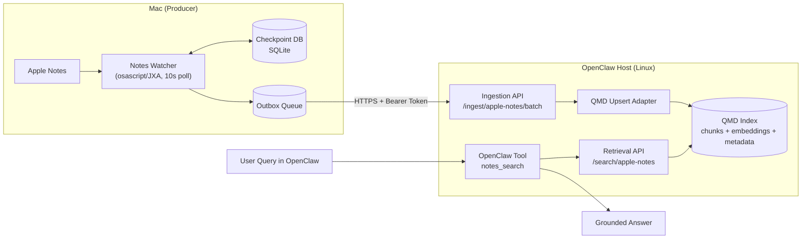
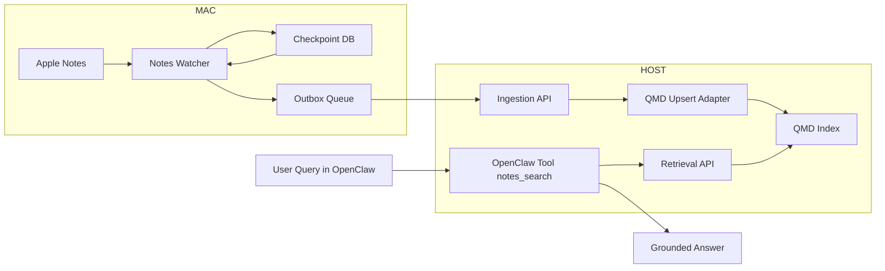
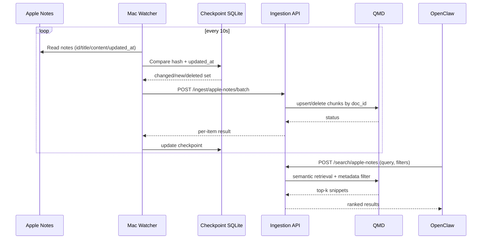
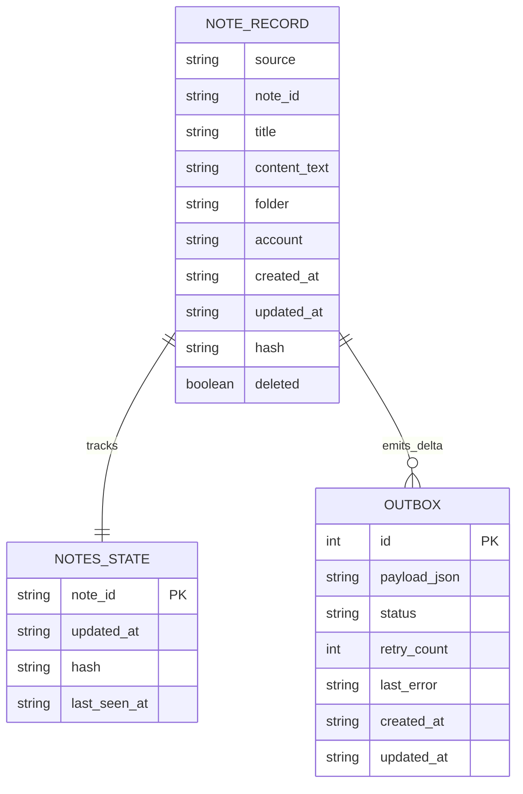

# Design Graph

## System Architecture (Mermaid)

## Compatibility Version (for older Mermaid parsers)

## Sync + Query Sequence (Mermaid)

## Data Entities

## Rendered SVG Assets

- `docs/graphs/architecture.svg`
- `docs/graphs/sequence.svg`
- `docs/graphs/entities.svg`
